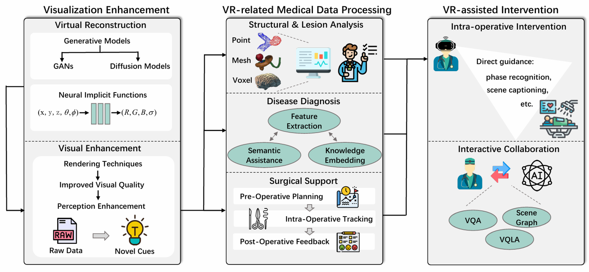

# Awesome AI-Enhanced Virtual Reality in Medicine
By Yixuan Wu (wyx chloe@zju.edu.cn) and kaiyuan Hu (kaiyuanhu@link.cuhk.edu.cn). We are continuously updating this page. Please do not hesitate to reach out to us with any questions or suggestions.

Please explore our survey paper presented in IJCAI 2024, Jeju, South Korea: [AI-Enhanced Virtual Reality in Medicine: A Comprehensive Survey] (https://www.ijcai.org/proceedings/2024/920)

## Visualization Enhancement

### Virtual Reconstruction 

#### Generative Models 
- [Diffusion Models for Medical Anomaly Detection] (https://conferences.miccai.org/2022/papers/158-Paper0704.html) [MICCAI 2022]
- [Diffusion Deformable Model for 4D Temporal Medical Image Generation] (https://conferences.miccai.org/2022/papers/157-Paper0467.html) [MICCAI 2022]
- [Fast Unsupervised Brain Anomaly Detection and Segmentation with Diffusion Models] (https://conferences.miccai.org/2022/papers/211-Paper1680.html) [MICCAI 2022]

#### Neural Implicit Functions
- [EndoSurf: Neural Surface Reconstruction of Deformable Tissues with Stereo Endoscope Videos] (https://conferences.miccai.org/2023/papers/241-Paper0178.html) [MICCAI 2023]
- [Implicit Neural Distance Representation for Unsupervised and Supervised Classification of Complex Anatomies] (https://miccai2021.org/openaccess/paperlinks/2021/09/01/236-Paper0939.html) [MICCAI 2021]
- [IREM: High-Resolution Magnetic Resonance Image Reconstruction via Implicit Neural Representation] (https://miccai2021.org/openaccess/paperlinks/2021/09/01/257-Paper0236.html) [MICCAI 2021]
- [Curvature-enhanced Implicit Function Network for High-quality Tooth Model Generation from CBCT Images] (https://conferences.miccai.org/2022/papers/119-Paper0756.html) [MICCAI 2022]
- [Single-subject Multi-contrast MRI Super-resolution via Implicit Neural Representations] (https://conferences.miccai.org/2023/papers/604-Paper1199.html) [MICCAI 2023]
- [3D Teeth Reconstruction from Panoramic Radiographs using Neural Implicit Functions] (https://conferences.miccai.org/2023/papers/005-Paper2035.html) [MICCAI 2023]
- [LightNeuS: Neural Surface Reconstruction in Endoscopy using Illumination Decline] (https://conferences.miccai.org/2023/papers/384-Paper3172.html) [MICCAI 2023]
- [SENDD: Sparse Efficient Neural Depth and Deformation for Tissue Tracking] (https://conferences.miccai.org/2023/papers/595-Paper1345.html) [MICCAI 2023]

### Visual Enhancement

#### Rendering
- [AR2T: Advanced Realistic Rendering Technique for Biomedical Volumes] (https://conferences.miccai.org/2023/papers/070-Paper2382.html) [MICCAI 2023]
- [Neural Rendering for Stereo 3D Reconstruction of Deformable Tissues in Robotic Surgery] (https://conferences.miccai.org/2022/papers/353-Paper1091.html) [MICCAI 2022]
- [Semantic Virtual Shadows (SVS) for Improved Perception in 4D OCT Guided Surgery] (https://conferences.miccai.org/2023/papers/591-Paper2069.html) [MICCAI 2023]

#### Perception Enhancement
- [Mixed Reality and Deep Learning for External Ventricular Drainage Placement: a Fast and Automatic Workflow for Emergency Treatments] (https://conferences.miccai.org/2022/papers/320-Paper1972.html) [MICCAI 2022]
- [Accurate and Robust Patient Height and Weight Estimation in Clinical Imaging using a Depth Camera] (https://conferences.miccai.org/2023/papers/036-Paper2373.html) [MICCAI 2023]
- [Image-based Incision Detection for Topological Intraoperative 3D Model Update in Augmented Reality Assisted Laparoscopic Surgery] (https://miccai2021.org/openaccess/paperlinks/2021/09/01/231-Paper0847.html) [MICCAI 2021]
- [Multi-task video enhancement for dental interventions] (https://conferences.miccai.org/2022/papers/345-Paper2559.html) [MICCAI 2022]

//TODO

## VR-related Medical Data Analysis

### Structural and Lesion Analysis

#### Voxel-based
- [CiT-Net: Convolutional Neural Networks Hand in Hand with Vision Transformers for Medical Image Segmentation] (https://www.ijcai.org/proceedings/2023/0113) [IJCAI 2023]
- [ScaleFormer: Revisiting the Transformer-based Backbones from a Scale-wise Perspective for Medical Image Segmentation] (https://www.ijcai.org/proceedings/2022/135) [IJCAI 2022]

#### Point-based
- [GRAB-Net: Graph-Based Boundary-Aware Network for Medical Point Cloud Segmentation] (https://ieeexplore.ieee.org/document/10093984) [IEEE TMI]
- [TSegNet: An efficient and accurate tooth segmentation network on 3D dental model] (https://www.sciencedirect.com/science/article/abs/pii/S1361841520303133) {Medical Image Analysis}

#### Mesh-based
- [Two-Stage Mesh Deep Learning for Automated Tooth Segmentation and Landmark Localization on 3D Intraoral Scans] (https://ieeexplore.ieee.org/document/9789163) [IEEE TMI]
- [TSGCNet: Discriminative Geometric Feature Learning with Two-Stream Graph Convolutional Network for 3D Dental Model Segmentation] (https://ieeexplore.ieee.org/document/9577925) [CVPR 2021]

### Disease Diagnosis

#### Extractor-forcused 
- [MedTransformer: Accurate ADdiagnosis for 3DMRI images through 2D Vision Transformers] (https://arxiv.org/abs/2401.06349v1)
- [M3T: three-dimensional Medical image classifier using Multi-plane and Multi-slice Transformer] (https://ieeexplore.ieee.org/document/9878673) [CVPR 2022]

#### Semantic-enhanced 
- [Combat Long-Tails in Medical Classification with Relation-Aware Consistency and Virtual Features Compensation] (https://dl.acm.org/doi/10.1007/978-3-031-43987-2_2) [MICCAI 2023]
- [MRI and SPECT Image Fusion Using a Weighted Parameter Adaptive Dual Channel PCNN] (https://ieeexplore.ieee.org/document/9072551) [IEEE SPL]
 
#### Knowledge-embedded 
- [CenterlinePointNet++: A New Point Cloud Based Architecture for Coronary Artery Pressure Drop and vFFR Estimation] (https://dl.acm.org/doi/abs/10.1007/978-3-031-43990-2_73) [MICCAI 2023]
- [GCL: Gradient-Guided Contrastive Learning for Medical Image Segmentation with Multi-Perspective Meta Labels] (https://dl.acm.org/doi/10.1145/3581783.3612113) [ACM Multimedia 2023]

### Surgical Support 

#### Post-operative Planning
- [Patient-Specific Virtual Spine Straightening and Vertebra Inpainting: An Automatic Framework for Osteoplasty Planning] (https://dl.acm.org/doi/10.1007/978-3-030-87202-1_51) [MICCAI 2021]
- [Point Cloud Diffusion Models for Automatic Implant Generation] (https://link.springer.com/chapter/10.1007/978-3-031-43996-4_11) [MICCAI 2023]

#### Intra-Operative Tracking
- [Liver lesion changes analysis in longitudinal CECT scans by simultaneous deep learning voxel classification with SimU-Net] (https://www.sciencedirect.com/science/article/abs/pii/S1361841522003036) [Medical Image Analysis]
- [Deep Lesion Tracker: Monitoring Lesions in 4D Longitudinal Imaging Studies] (https://ieeexplore.ieee.org/document/9578122) [CVPR 2021]

#### Post-operative Feedback
- [Rendezvous: Attention mechanisms for the recognition of surgical action triplets in endoscopic videos] (https://www.sciencedirect.com/science/article/abs/pii/S1361841522000846) [Medical Image Analysis]
- [EndoNet: A Deep Architecture for Recognition Tasks on Laparoscopic Videos] (https://ieeexplore.ieee.org/document/7519080) [IEEE TMI]
- [Bridging Ex-Vivo Training and Intra-operative Deployment for Surgical Margin Assessment with Evidential Graph Transformer] (https://dl.acm.org/doi/10.1007/978-3-031-43990-2_53) [MICCAI 2023]

## VR-assisted Intervention

### Intra-operaive Intervention
#### Virtual Assistance Platform
- [SurgeonAssist-Net: Towards Context-Aware Head-Mounted Display-Based Augmented Reality for Surgical Guidance] (https://miccai2021.org/openaccess/paperlinks/2021/09/01/463-Paper1825.html) [MICCAI 2021]
- [Mixed Reality and Deep Learning for External Ventricular Drainage Placement: a Fast and Automatic Workflow for Emergency Treatments] (http://conferences.miccai.org/2022/papers/320-Paper1972.html) [MICCAI 2022]
- [Image-based Incision Detection for Topological Intraoperative 3D Model Update in Augmented Reality Assisted Laparoscopic Surgery] (https://miccai2021.org/openaccess/paperlinks/2021/09/01/231-Paper0847.html) [MICCAI 2021]
- [Intraoperative CT augmentation for needle-based liver interventions] (https://conferences.miccai.org/2023/papers/350-Paper1521.html) [MICCAI 2023]

#### Phase Recogition
- [Exploring Segment-Level Semantics for Online Phase Recognition From Surgical Videos] (https://ieeexplore.ieee.org/document/9795918) [IEEE TMI]

#### Scene Captioning
- [Automatic captioning for medical imaging (MIC): a rapid review of literature] (https://dl.acm.org/doi/abs/10.1007/s10462-022-10270-w) [Artificial Intelligence Review]

### Interactive Collaboration

#### Vision Question Answering
- [Surgical-VQA: Visual Question Answering in Surgical Scenes using Transformer] (https://conferences.miccai.org/2022/papers/491-Paper0916.html) [MICCAI 2022]
- [SurgicalGPT: End-to-End Language-Vision GPT for Visual Question Answering in Surgery] (https://link.springer.com/chapter/10.1007/978-3-031-43996-4_27) [MICCAI 2023]

#### Visual Question Localized-Answering
- [Revisiting Distillation for Continual Learning on Visual Question Localized-Answering in Robotic Surgery] (https://conferences.miccai.org/2023/papers/547-Paper0548.html) [MICCAI 2023]
- [Surgical-VQLA:Transformer with Gated Vision-Language Embedding for Visual Question Localized-Answering in Robotic Surgery] (https://ieeexplore.ieee.org/document/10160403) [IEEE ICRA 2023]

#### Scene Graph Construction
- [Holistic OR domain modeling: a semantic scene graph approach] (https://link.springer.com/article/10.1007/s11548-023-03022-w) [International Journal of Computer Assisted Radiology and Surgery]

### Datasets
- [MVOR: A Multi-view RGB-D Operating Room Dataset for 2D and 3D Human Pose Estimation] (https://github.com/CAMMA-public/mvor) [MICCAI-LABELS-2018 ]
- [Automatic Operating Room Surgical Activity Recognition for Robot-Assisted Surgery] (https://link.springer.com/chapter/10.1007/978-3-030-59716-0_37) [MICCAI 2020]
- [4D-OR: Semantic Scene Graphs for OR Domain Modeling] (https://github.com/egeozsoy/4D-OR) [MICCAI 2022]
